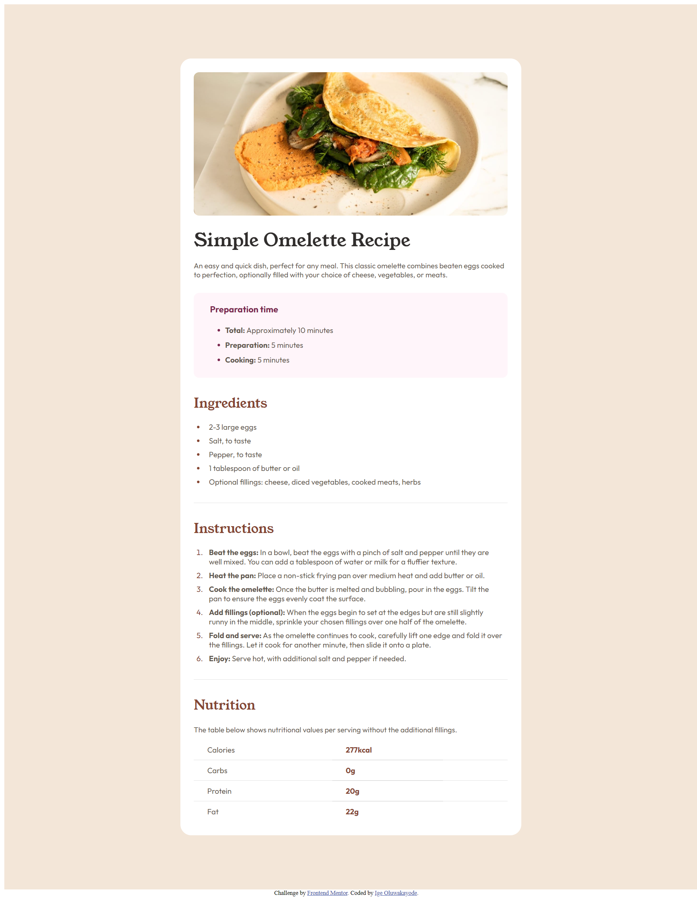

# Frontend Mentor - Recipe page solution

This is a solution to the [Recipe page challenge on Frontend Mentor](https://www.frontendmentor.io/challenges/recipe-page-KiTsR8QQKm). Frontend Mentor challenges help you improve your coding skills by building realistic projects. 

## Table of contents

- [Overview](#overview)
  - [Screenshot](#screenshot)
  - [Links](#links)
- [My process](#my-process)
  - [Built with](#built-with)
  - [What I learned](#what-i-learned)
  - [Continued development](#continued-development)
  - [Useful resources](#useful-resources)
- [Author](#author)
- [Acknowledgments](#acknowledgments)

## Overview
This is a webpage that shows a recipe page solution for a simple Omelette using HTML and CSS.

### Screenshot



### Links

- Solution URL: [Add solution URL here](https://github.com/Jesuis-Jacques/recipe-page.git)
- Live Site URL: [Add live site URL here](https://jesuis-jacques.github.io/recipe-page/)

## My process
- Firstly, I downloaded the required starting files for the project.
- Then I initialised Git for version control.
- Created an HTML file to set the structure right [Used semantic HTML for this project].
- Then i used CSS to style it.
  - Went to get the link required to deploy the required font [outfit] and [young-serif] on the webpage.
  - Adjusted accordingly for the paragraphs using padding to look exactly like the design.
- Finally, i made the webpage responsive to all chosen screen sizes with the use of media query.
- Separated the CSS styles into sections.
  - Linked them all to the project.


### Built with

- Semantic HTML
- CSS custom properties
- Flexbox
- CSS Grid
- Mobile-view workflow

### What I learned

I dived deeply into the world of HTML, swimming the deep into the waters of semantic HTML: using tags such as [article] for the whole recipe page since it is somewhat like an article, [section] for each section in the article, [ul] and [ol] for unordered and ordered lists respectively, [headers] in its appropriateness and [table] for the table subsection. I actually feel empowered with semantic HTML diving skill right now, lol.

Although, I am reaaly proud of all the code in this particular project. however, some code snippets I'd love to share are:

```html
<ul>
  <li>
    2-3 large eggs
  </li>
  <li>
    Salt, to taste
  </li>
  <li>
    Pepper, to taste
  </li>
  <li>
    1 tablespoon of butter or oil
  </li>
  <li>
    Optional fillings: cheese, diced vegetables, cooked meats, herbs
  </li>
</ul>

<table>
  <tr>
    <td>Calories</td>
    <td class="measurement">277kcal</td>
  </tr>

  <tr>
    <td>Carbs</td>
    <td class="measurement">0g</td>
  </tr>

  <tr>
    <td>Protein</td>
    <td class="measurement">20g</td>
  </tr>

  <tr>
    <td class="last-table-row">Fat</td>
    <td class="last-table-row measurement">22g</td>
  </tr>
</table>
```

```css
tr {
  display: grid;
  grid-template-columns: 1fr 1fr;
}

.instructions-section li::marker {
  color:hsl(14, 45%, 36%);
}
```

### Continued development

I look forward to understanding more on semantic HTML, HTML5 and CSS frameworks;having my own dynamic, personal full-stack developer website where people can get to know me as tho on a personal level.
Solving complex problems with programming!

### Useful resources

- [Resource 1](https://www.w3schools.com/tags/default.asp) - This helped me with unerstanding semantic HTML. Made me know the article tag was appropriate to use for the container of this project. It also helped with some styling suggestions as you can find in the CSS section. I highly recommend!.

## Author

- Github - [Oluwakayode Ige](https://www.github.com/jacquesnotjack)
- Frontend Mentor - [@jacquesnotjack](https://www.frontendmentor.io/profile/jacquesnotjack)
- Twitter - [@jacquesnotjack](https://www.twitter.com/jacquesnotjack)

## Acknowledgments

N/A
